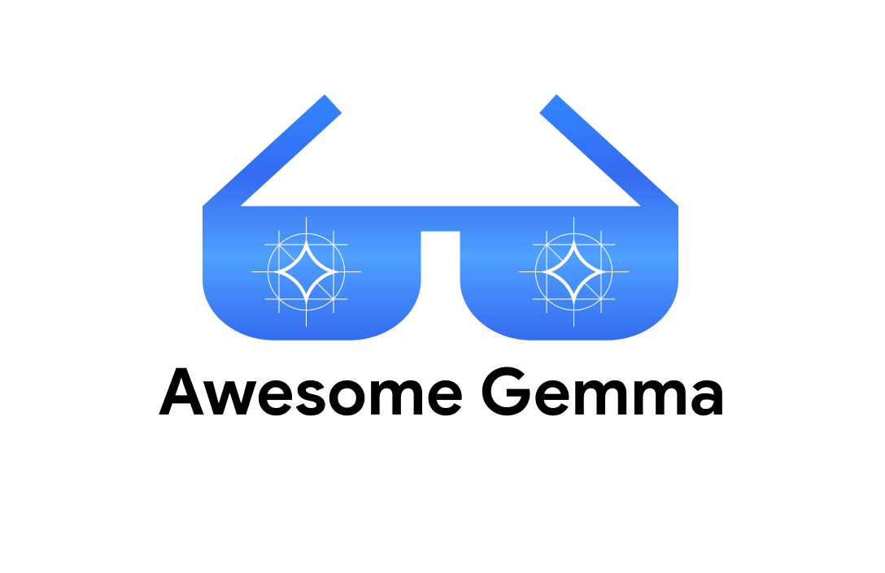

	 
	 
	<h1>
		<a href="https://deepmind.google/models/gemma/">
			<picture>
				<source media="(prefers-color-scheme: dark)" srcset="media/logo-dark.svg">
				
			</picture>
		</a>
	</h1>
	 
	

		<a href="https://deepmind.google/models/gemma/">Gemma</a> is Google DeepMind's family of lightweight, state-of-the-art open models.
	

	

## Contents

- [Start Here](#start-here)
- [Models](#models)
  - [Core Models](#core-models)
  - [Variants](#variants)
- [Inference](#inference)
  - [Local](#local)
  - [Hosted](#hosted)
- [Fine-Tune](#fine-tune)
- [Tutorials](#tutorials)
- [Demos and Applications](#demos-and-applications)
- [Gemma 4 Good Challenge](#gemma-4-good-challenge)
- [Gemma in Space](#gemma-in-space)
- [Research and Evaluation](#research-and-evaluation)

## Start Here

- [Gemma Documentation](https://ai.google.dev/gemma/docs) — Official documentation for selecting, running, tuning, and deploying Gemma models.
- [Get Started with Gemma](https://ai.google.dev/gemma/docs/get_started) — Get started running inference with the multimodal Gemma 4 models.
- [Gemma Cookbook](https://github.com/google-gemma/cookbook) — Maintained notebooks, examples, workshops, and end-to-end applications.
- [Gemma Skills](https://github.com/google-gemma/gemma-skills) — Reusable Agent Skills for selecting, running, and training Gemma models.
- [Gemma Events](https://luma.com/gemma-events) — Overview of upcoming Gemma events.
- [Gemma on X](https://x.com/googlegemma) — For news, announcements, and updates about Gemma.

## Models

### Core Models

- [Gemma 4 Overview](https://ai.google.dev/gemma/docs/core) — An overview of the capabilities, architecture, and more of Gemma 4 models.
- [Gemma 4 Model Card](https://ai.google.dev/gemma/docs/core/model_card_4) — Architecture, training, evaluation, safety, and usage details.
- [Gemma 4 (Hugging Face)](https://huggingface.co/collections/google/gemma-4) — Gemma 4 checkpoints on Hugging Face.
- [Gemma 4 QAT](https://huggingface.co/collections/google/gemma-4-qat-q4-0) — Quantization-aware checkpoints for local and server inference.
- [Gemma 4 Mobile QAT](https://huggingface.co/collections/google/gemma-4-qat-mobile) — Mobile-optimized checkpoints for the E2B and E4B models.
- [Previous Gemma Model Cards](https://deepmind.google/models/model-cards/) — Model cards for Gemma 1–3 and earlier Gemma families.

### Variants

- [DiffusionGemma](https://ai.google.dev/gemma/docs/diffusiongemma/model_card) — Experimental discrete-diffusion text generation based on Gemma 4.
- [EmbeddingGemma](https://ai.google.dev/gemma/docs/embeddinggemma/model_card) — Compact embedding model designed for retrieval and on-device use.
- [FunctionGemma](https://ai.google.dev/gemma/docs/functiongemma/model_card) — Foundation for building specialized function-calling models.
- [MedGemma](https://deepmind.google/models/gemma/medgemma/) — Models optimized for medical text and image comprehension.
- [PaliGemma 2](https://ai.google.dev/gemma/docs/paligemma/model-card-2) — Vision-language models for detailed image understanding tasks.
- [ShieldGemma 2](https://ai.google.dev/gemma/docs/shieldgemma/model_card_2) — Image-safety classifier built on Gemma 3.
- [T5Gemma 2](https://huggingface.co/collections/google/t5gemma-2) — Encoder-decoder models for contextual understanding and generation.
- [DolphinGemma](https://deepmind.google/models/gemma/dolphingemma/) — Uses dolphin audio to help scientists study how dolphins communicate.
- [TranslateGemma](https://huggingface.co/collections/google/translategemma) — Translation models covering 55 languages.
- [TxGemma](https://huggingface.co/collections/google/txgemma-release) — Models for therapeutic-development research.
- [VaultGemma](https://deepmind.google/models/gemma/vaultgemma/) — Language model trained with differential privacy.
- [DataGemma](https://huggingface.co/collections/google/datagemma-release) — Models and recipes for grounding responses with Data Commons.
- [RecurrentGemma](https://huggingface.co/collections/google/recurrentgemma-release) — Open models based on the recurrent Griffin architecture.
- [Gemma Scope 2](https://ai.google.dev/gemma/docs/gemma_scope) — Open sparse autoencoders and interpretability tooling for studying Gemma 3.
- [Gemma-APS](https://deepmind.google/models/gemma/gemma-aps/) — Abstractive proposition segmentation for decomposing text into meaningful claims.
- [Cell2Sentence-Scale](https://huggingface.co/vandijklab/C2S-Scale-Gemma-2-27B) — A Gemma 2 27B model fine-tuned for single-cell biology.

## Inference

### Local

- [HF Transformers](https://huggingface.co/docs/transformers/model_doc/gemma4) — Python library for loading, running, and fine-tuning Hugging Face models.
- [llama.cpp](https://huggingface.co/collections/ggml-org/gemma-4) — LLM inference in C/C++ with GGUF quantization.
- [Unsloth](https://unsloth.ai/docs/models/gemma-4) — Local UI to run and train LLMs and diffusion models.
- [Ollama](https://ollama.com/library/gemma4) — Get up and running with large language models locally.
- [LM Studio](https://lmstudio.ai/models/gemma-4) — Desktop application to discover, download, and run local models.
- [vLLM](https://docs.vllm.ai/projects/recipes/en/stable/Google/Gemma4.html) — High-throughput and memory-efficient LLM serving engine.
- [SGLang](https://lmsysorg.mintlify.app/cookbook/autoregressive/Google/Gemma4) — Fast serving framework for large language models and vision-language models.
- [AI Edge Gallery](https://github.com/google-ai-edge/gallery) — On-device ML models and examples for mobile and edge devices.
- [LiteRT](https://developers.google.com/edge/litert-lm/models/gemma-4) — Google's runtime for on-device ML deployment.
- [JAX](https://github.com/google-deepmind/gemma) — Official Gemma reference implementation in JAX and Flax.
- [React Native](https://github.com/software-mansion/react-native-executorch/tree/main/apps/llm) — Run on-device Gemma models within React Native using ExecuTorch.
- [GenieX](https://aihub.qualcomm.com/models/gemma_4_e4b_it) — Run Gemma on Qualcomm hardware.
- [Docker](https://hub.docker.com/r/ai/gemma4) — Run Gemma 4 in Docker.

### Hosted

- [Gemini Enterprise Agent Platform (Formerly Vertex AI)](https://console.cloud.google.com/agent-platform/publishers/google/model-garden/gemma4) — Fully managed enterprise AI platform on Google Cloud.
- [OpenRouter](https://openrouter.ai/google/gemma-4-31b-it) — Unified API routing to multiple AI model providers.
- [Cerebras](https://inference-docs.cerebras.ai/models/gemma-4-31b) — High-speed Gemma 4 inference on Cerebras.
- [NVIDIA](https://huggingface.co/nvidia/Gemma-4-31B-IT-NVFP4) — Optimized TensorRT-LLM and NVFP4 checkpoints.
- [AMD](https://www.amd.com/en/developer/resources/technical-articles/2026/day-0-support-for-gemma-4-on-amd-processors-and-gpus.html) — Support for AMD ROCm GPUs and processors.
- [AI Studio](https://aistudio.google.com/app/prompts/new_chat?model=gemma-4-31b-it) — Web-based prototyping and development environment.
- [Cloud Run](https://docs.cloud.google.com/run/docs/run-gemma-on-cloud-run) — Deploy containerized Gemma services with autoscaling GPUs.
- [LiveKit](https://livekit.com/products/inference/gemma-4) — Real-time multimodal voice and video inference infrastructure.
- [Together AI](https://www.together.ai/models/gemma-4-31b) — Cloud platform for running and fine-tuning open source models.
- [Modal](https://modal.com/docs/launch/gemma-4) — Run and deploy Gemma 4 on the Modal platform.
- [Fireworks](https://fireworks.ai/models/fireworks/gemma-4-31b-it) — Run and deploy Gemma 4 on the Fireworks.AI platform.
- [BaseTen](https://www.baseten.co/library/publisher/gemma/) — Run and deploy Gemma 4 on the BaseTen platform.
- [Runpod](https://docs.runpod.io/tutorials/serverless/run-gemma-7b) — Experiment, train, fine-tune, and deploy Gemma.
- [Cloudflare](https://developers.cloudflare.com/workers-ai/models/gemma-4-26b-a4b-it/)  — Run Gemma 4 on the Workers AI LLM Playground.

## Fine-Tune

- [Fine-Tune Gemma](https://ai.google.dev/gemma/docs/tune) — Official framework guide covering Keras, JAX, Hugging Face, Unsloth, Axolotl, and Google Cloud.
- [Gemma Cookbook: Training](https://github.com/google-gemma/cookbook/tree/main/docs/core) — Official fine-tuning notebooks and training recipes.
- [Tunix](https://github.com/google/tunix) — JAX-native library for post-training generative models.
- [Unsloth Gemma 4 fine-tuning guide](https://unsloth.ai/docs/models/gemma-4/train) — Train Gemma 4 E2B, E4B, 12B, 26B A4B and 31B with Unsloth.
- [Gemma Multimodal Tuner](https://github.com/mattmireles/gemma-tuner-multimodal) — Fine-tune Gemma 3n and Gemma 4 with text, images, and audio on Apple Silicon.
- [MLX Tune](https://github.com/ARahim3/mlx-tune#gemma-4-audio-fine-tuning) — MLX-native SFT, preference tuning, and multimodal fine-tuning with Gemma 4 support.

## Tutorials

- [A Visual Guide to Gemma 4](https://newsletter.maartengrootendorst.com/p/a-visual-guide-to-gemma-4)
- [A Visual Guide to Gemma 4 12B](https://newsletter.maartengrootendorst.com/p/a-visual-guide-to-gemma-4-12b)
- [A Visual Guide to DiffusionGemma](https://newsletter.maartengrootendorst.com/p/a-visual-guide-to-diffusiongemma)
- [A Visual Guide to the Gemma 4 Drafters](https://x.com/googlegemma/status/2051694045869879749)
- [Variable Aspect Ratio and Variable Resolutions in Gemma 4](https://x.com/googlegemma/status/2047734622109466893)
- [How to Use Transformers.js in a Chrome Extension](https://huggingface.co/blog/transformersjs-chrome-extension)
- [How to run a local coding agent with Gemma 4 and Pi](https://patloeber.com/gemma-4-pi-agent/)
- [How to run Gemma 4 with OpenClaw](https://x.com/googlegemma/status/2041512106269319328)
- [How a Small Fix Improves Gemma 4 Vision Performance](https://www.overshoot.ai/blogs/gemma-4-batched-encoder)
- [While I slept, my 5-year-old MacBook ran Gemma 4 locally and indexed a year of video](https://blog.simbastack.com/indexed-a-year-of-video-locally/)
- [Fine-tuning Gemma 4 12B on your own data](https://x.com/akshay_pachaar/status/2063610194618396728)
- [Turning Gemma 4 into an Old Korean Translator](https://dev.to/googleai/turning-gemma-4-into-an-old-korean-translator-hop)

## Demos and Applications

- [Gemma 4 Vision Token Budget](https://huggingface.co/spaces/google/gemma4_vision_token_budget) — Explore the effect of image resolution and visual-token budgets.
- [Concurrent Gemma](https://github.com/google-gemma/cookbook/tree/main/apps/concurrent) — Run and compare multiple concurrent local Gemma instances.
- [See what 3 builders are making with Gemma 4](https://blog.google/innovation-and-ai/technology/developers-tools/gemma-4-builders/) — Various applications developed by the community.
- [AIventure](https://github.com/bebechien/AIventure) — A 2D grid-based adventure game built with Phaser 3 and Angular with Gemma driving it.
- [Gemma Chat](https://github.com/ammaarreshi/gemma-chat) — Local AI chat + coding agent for Apple Silicon, powered by Gemma 4 via MLX / Supports Ollama.
- [Build with Gemma 4 and Haystack](https://haystack.deepset.ai/cookbook/gemma_chat_rag) — Runnable notebook covering RAG, visual question answering, a multimodal weather agent, and GitHub tool discovery.
- [Gemma 4 Browser Extension](https://github.com/nico-martin/gemma4-browser-extension) — Local browser agent powered by Gemma 4, WebGPU, and Transformers.js.
- [WebGemma](https://github.com/NSTiwari/WebGemma) — Browser playground and interactive model timeline powered by WebGPU and Transformers.js.
- [Controlling an iOS simulator](https://x.com/swmansion/status/2054949426485993669) — Gemma 4 using Argent to control an iOS simulator showcasing its capabilities in agentic workflows.
- [Automated Video Segmentation & Tracking](https://x.com/dahou_yasser/status/2044372250644901899) — A demo that uses Gemma 4 + Falcon Perception for video tracking.
- [Parking Lot Car Detection & Segmentation](https://x.com/MaziyarPanahi/status/2042592050940449260) — Gemma 4 analyzes the scene, decides the questions, generates prompts, and calls SAM 3.1 as a tool. SAM 3.1 segments and returns results.
- [Gemma 4 and MTP as a Marathon Engine](https://dev.to/gde/the-local-model-that-doesnt-sleep-gemma-4-mtp-as-a-marathon-engine-4c9) — Benchmarks speculative decoding across increasing context lengths.
- [Cactus Hybrid](https://github.com/cactus-compute/cactus-hybrid) — Post-trained Gemma 4 models to recognize when they are wrong, run on any framework.
- [Damage Scout](https://x.com/cerebras/status/2075671402091606416) — Damage Scout samples frames from a rental car walkaround, sends them to Gemma 4, gets back structured findings and box coordinates, then renders an annotated damage report in under 6 seconds.
- [MedGemma Impact Challenge](https://www.kaggle.com/competitions/med-gemma-impact-challenge/hackathon-winners) — The winners of the MedGemma hackathon to build human-centered AI applications with MedGemma.
- [Gemma-Translator](https://github.com/google-gemma/gemma-translator) — A fully offline device powered by Gemma 4 E2B built with Google Antigravity.
- [Real-Time Voice AI with Gemma 4](https://huggingface.co/blog/cerebras-gemma4-voice-ai) — Open-source cascaded voice stack using Gemma 4 for low-latency reasoning.

## Gemma 4 Good Challenge

[Amazing projects](https://www.kaggle.com/competitions/gemma-4-good-hackathon) that harness the power of Gemma 4 to drive positive change and global impact.

- [Trido](https://www.kaggle.com/competitions/gemma-4-good-hackathon/writeups/trido) — A Voice-Driven AI Whiteboard Built for the Teacher Nobody Builds For.
- [CodeBuddy](https://www.kaggle.com/competitions/gemma-4-good-hackathon/writeups/new-writeup-1778344276798) — AI Python Tutor for Indonesian Students.
- [Port-a-Prof](https://www.kaggle.com/competitions/gemma-4-good-hackathon/writeups/port-a-prof) — Deeper learning, wherever you are.
- [TriageMate](https://www.kaggle.com/competitions/gemma-4-good-hackathon/writeups/triagemate-offline-first-clinical-ai-for-ghanas) — Offline-first Clinical AI for Ghana's Community Health Officers.
- [ORCA-G4](https://www.kaggle.com/competitions/gemma-4-good-hackathon/writeups/orca-g4) — On-device oral cancer intelligence for 900,000 ASHA workers in rural India.
- [DEMENTOR](https://www.kaggle.com/competitions/gemma-4-good-hackathon/writeups/dementor-edge-ai-triage-for-dementia-care) — Edge AI Triage for Dementia Care.
- [PreVillage](https://www.kaggle.com/competitions/gemma-4-good-hackathon/writeups/previllage-a-govspeak-platform) — A source-backed navigator for Nepal’s government services, built to find the office route, not just the form.
- [BrailleOut](https://www.kaggle.com/competitions/gemma-4-good-hackathon/writeups/new-writeup-1779137654649) — An assistive device that reads the text and images from real-world and converts it to Braille using Gemma 4 and Ollama.
- [Gem-Care](https://www.kaggle.com/competitions/gemma-4-good-hackathon/writeups/gem-care-gemma-4-good-hackathon) — Gemma-4-Enriched with Multimodal Clinical-context Adaptation for Recognition Enhancement of Non-Normative Speech.
- [Trajectix](https://www.kaggle.com/competitions/gemma-4-good-hackathon/writeups/trajectix-an-agentic-flight-recorder-for-ai-infra) — An Agentic Flight Recorder for AI Infrastructure Safety.
- [TrueVoice](https://www.kaggle.com/competitions/gemma-4-good-hackathon/writeups/new-writeup-1776369081947) — AI Voice Deepfake Detector.
- [AI Conceptualizer](https://www.kaggle.com/competitions/gemma-4-good-hackathon/writeups/new-writeup-1779074198441) — 3D visualizations for mechanistic interpretability and "concept spectroscopy".
- [Acuífero·Vigía](https://www.kaggle.com/competitions/gemma-4-good-hackathon/writeups/acuifero4vigia) — Hybrid edge-and-citizen flood early warning for Argentina's Litoral, where every minute of warning is a life.
- [ResQ](https://www.kaggle.com/competitions/gemma-4-good-hackathon/writeups/resq) — Offline Multilingual Disaster Response Coach on Gemma 4 E2B.

## Gemma in Space

- [Starcloud-1](https://www.cnbc.com/2025/12/10/nvidia-backed-starcloud-trains-first-ai-model-in-space-orbital-data-centers.html) — Starcloud deployed and ran Gemma in orbit aboard an H100 GPU.
- [NASA](https://spectrum.ieee.org/nasa-ai-satellite-image-analysis) — NASA runs Gemma in orbit to analyze satellite imagery and compress visual data into text for rapid, low-bandwidth disaster response.

## Research and Evaluation

- [Gemma 4 Technical Report](https://arxiv.org/abs/2607.02770) — The technical report covering Gemma 4 E2B, E4B, 12B, 26B A4B, and 31B.
- [DiffusionGemma Technical Report](https://arxiv.org/abs/2608.00146) — The technical report covering DiffusionGemma.
- [Artificial Analysis](https://artificialanalysis.ai/models/gemma-4-31b) — Intelligence, Performance & Price Analysis.
- [ChessBench](https://x.com/googlegemma/status/2054283302090277123) — Chess LLM Benchmark Leaderboard.
- [TERMS-Bench](https://x.com/ericavaneee/status/2055868536099381638) — A benchmark for LLM negotiation agents based on economic negotiation.

## Footnotes

This is not an officially supported Google product. This project is not eligible for the [Google Open Source Software Vulnerability Rewards Program](https://bughunters.google.com/open-source-security).
